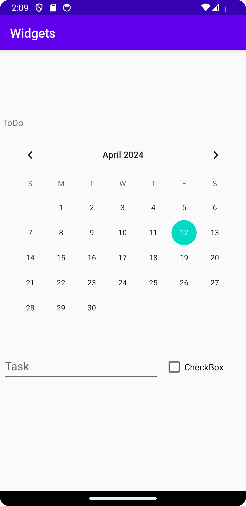

Efter en stunds planering beslöt jag mig för att göra en lätt variant av en ToDo-lista, 
detta innefattar implementering av TextView, Calander, EditText och CheckBox. 
Det första som implementerades en Vertikal layout i den existerande constraint layout, 
jag satte en lämplig storlek på denna och även constraint till parent.

    <LinearLayout
        android:id="@+id/linearLayout"
        android:layout_width="match_parent"
        android:layout_height="500dp"
        android:orientation="vertical"
        app:layout_constraintBottom_toBottomOf="parent"
        app:layout_constraintEnd_toEndOf="parent"
        app:layout_constraintStart_toStartOf="parent"
        app:layout_constraintTop_toTopOf="parent">

Efter detta lades TextView, CalendarView till, då det är en vertikal layout hamnar dessa under varandra. 
Jag valde att lägga en horisontell layout i vertikala då jag ville att EditText och CheckBox skulle ligga bredvid varandra istället för under varandra. 
När dessa var korrekt implementerade ändrade jag storlek på samtliga och lade till en margin.

       <EditText 
            android:id="@+id/edittext" 
            android:layout_width="250dp" 
            android:layout_height="50dp" 
            android:hint="Task" 
            android:layout_marginStart="4dp" 
            android:layout_marginTop="4dp" 
            android:layout_marginEnd="4dp" 
            android:layout_marginBottom="4dp"> 
 
        </EditText> 

Bilder läggs i samma mapp som markdown-filen.

Läs gärna:

- Boulos, M.N.K., Warren, J., Gong, J. & Yue, P. (2010) Web GIS in practice VIII: HTML5 and the canvas element for interactive online mapping. International journal of health geographics 9, 14. Shin, Y. &
- Wunsche, B.C. (2013) A smartphone-based golf simulation exercise game for supporting arthritis patients. 2013 28th International Conference of Image and Vision Computing New Zealand (IVCNZ), IEEE, pp. 459–464.
- Wohlin, C., Runeson, P., Höst, M., Ohlsson, M.C., Regnell, B., Wesslén, A. (2012) Experimentation in Software Engineering, Berlin, Heidelberg: Springer Berlin Heidelberg.
